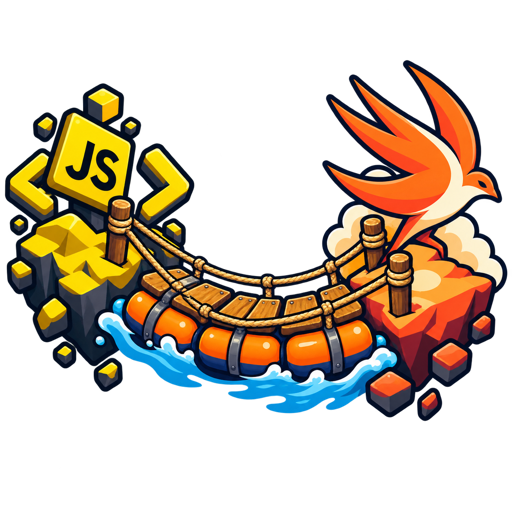

<p align="center">
  
</p>

<h1 align="center">Pontoon</h1>

<p align="center">
  A typed, bidirectional bridge between JavaScript running in <code>WKWebView</code> and native Swift.
</p>

<p align="center">
  
  
  
  
  
</p>

---

Pontoon turns the raw `WKWebView` message plumbing into two symmetric, `async/await` friendly calls:

- **JS → Swift** — expose native functions on a JS namespace; each one is a real `Promise` on the web side, with `Codable` parameters and payloads on the native side.
- **Swift → JS** — `await` a JavaScript function from Swift and get its settled promise back, decoded.

No string-typed callbacks, no manual `evaluateJavaScript` result parsing, no `WKScriptMessageHandler` boilerplate per function.

## Requirements

| | |
|---|---|
| Swift | 6.0+ (Swift 6 language mode) |
| Xcode | 16+ |
| Platforms | iOS 16+ · macOS 13+ · Mac Catalyst 16+ · visionOS 1+ |
| Dependencies | none (WebKit + Foundation only) |

## Installation

Swift Package Manager — add the dependency to your `Package.swift`:

```swift
dependencies: [
    .package(url: "https://github.com/sanllier/Pontoon.git", from: "1.0.0")
]
```

…and list it among the target's dependencies:

```swift
.target(name: "MyApp", dependencies: ["Pontoon"])
```

In Xcode: **File → Add Package Dependencies…** and paste the repository URL.

## Quick start

### 1. Expose native functions to JavaScript

```swift
import WebKit
import Pontoon

struct ShareParameters: Decodable {
    var text: String
    var url: URL?
}

struct ShareResult: Encodable, Sendable {
    var shared: Bool
}

struct ShareError: Encodable, Sendable {
    var reason: String
}

let bridge = try webView.installBridge(
    namespace: "myApp",
    securityPolicy: try .init(allowedOrigins: ["https://app.example.com"])
) {
    ClosureNativeFunction("share") { (parameters: ShareParameters, bridge) in
        guard let url = parameters.url else {
            return .failure(ShareError(reason: "missing url"))
        }
        return .success(ShareResult(shared: await ShareService.share(parameters.text, url: url)))
    }
}
```

The installed bridge stays alive with the web view, so you only need to keep the returned `Bridge` when you plan to call into JavaScript. Because the bridge owns your function closures for that whole time, capture `self` weakly in them — otherwise anything holding the web view keeps itself alive through the bridge.

On the web side the function is a plain promise-returning method on the namespace object:

```js
try {
    const result = await window.myApp.share({ text: "Hello", url: "https://example.com" });
    console.log(result.shared);
} catch (error) {
    if (error.name === "PontoonBridgeError") {
        console.log("bridge failed:", error.code, error.message);
    } else {
        console.log("rejected by native code:", error.reason);
    }
}
```

### 2. Call JavaScript from Swift

Declare the function on the same namespace object from the page (it may return a value or a promise):

```js
window.myApp.onCartUpdated = async function (cart) {
    await renderCart(cart);
    return { accepted: true };
};
```

Then `await` it from Swift:

```swift
struct Cart: Encodable {
    var items: [String]
}

struct Ack: Decodable {
    var accepted: Bool
}

let ack = try await bridge.call(
    "onCartUpdated",
    parameters: Cart(items: ["apple", "pear"]),
    as: Ack.self
)
print(ack.accepted)
```

If the JS promise rejects, this throws `JSCallError.rejected(payloadJSON:)` with the raw reason. When the rejection has a shape you care about, ask for both branches instead:

```swift
struct Rejection: Decodable {
    var reason: String
}

let result = try await bridge.call(
    "onCartUpdated",
    parameters: Cart(items: ["apple", "pear"]),
    as: Ack.self,
    rejectingAs: Rejection.self
)

switch result {
case .resolved(let ack): print(ack.accepted)
case .rejected(let rejection): print(rejection.reason)
}
```

Parameters and results are both optional — pick the overload that fits:

```swift
try await bridge.call("onSessionExpired")
try await bridge.call("track", parameters: event)
let state = try await bridge.call("currentState", as: PageState.self)
```

### 3. Reusable native functions

Conform to `TypedNativeFunction` for anything more involved than a closure — parameter decoding comes with the protocol:

```swift
struct GetTokenFunction: TypedNativeFunction {

    let name = "getToken"
    let tokenProvider: TokenProvider

    func handle(parameters: JSVoid, bridge: Bridge) async -> NativeFunctionResult {
        struct Token: Encodable, Sendable { var value: String }
        return .success(Token(value: await tokenProvider.currentToken()))
    }

}
```

A function that takes no arguments drops the parameter entirely, and `.empty` stands for a result with nothing in it. Both styles mix inside the same builder, and the builder accepts conditionals:

```swift
let bridge = try webView.installBridge(
    namespace: "myApp",
    securityPolicy: try .init(allowedOrigins: ["https://app.example.com"])
) {
    GetTokenFunction(tokenProvider: provider)
    ClosureNativeFunction("logout") { bridge in
        await session.logout()
        return .empty
    }
    if configuration.isDebug {
        ClosureNativeFunction("dumpState") { bridge in .success(debugState()) }
    }
}
```

A set assembled at runtime goes in as an array — the builder accepts one directly:

```swift
let bridge = try webView.installBridge(
    namespace: "myApp",
    securityPolicy: try .init(allowedOrigins: ["https://app.example.com"])
) {
    functions
}
```

## Installing and uninstalling

```swift
func installBridge(
    namespace: String,
    securityPolicy: BridgeSecurityPolicy,
    injecting injection: BridgeInjection = .atDocumentStart,
    contentWorld: WKContentWorld = .page,
    @NativeFunctionsBuilder functions: () -> [any NativeFunction]
) throws(BridgeSetupError) -> Bridge
```

| Injection | Behaviour |
|---|---|
| `.atDocumentStart` | Default. Registered as a user script, so the namespace exists before any page code runs — and survives navigation. |
| `.immediately` | Injected right now via `evaluateJavaScript`, for a page that is already loaded. Does **not** survive navigation. |
| `.immediatelyAndAtDocumentStart` | Both — the live page gets the bridge now, later documents get it at start. |

Installation validates the setup and throws `BridgeSetupError` for an invalid namespace or function name (both must be JS identifiers), a name starting with the reserved `_pontoon` prefix, a duplicate function name, or a malformed origin in the policy. Pontoon does not keep a denylist of JavaScript globals — picking `fetch` or `crypto` as a namespace will break the page loudly, and no list of that kind can ever be complete.

`bridge.uninstall()` closes both directions: the script message handler is removed, `isInstalled` reports `false`, and further `call`s throw `bridgeDetached`. WebKit offers no way to remove a single user script, so the injected wrappers stay on the current page and stop working; on the next document the script exits early and the namespace is simply absent, which the page sees as a `TypeError` rather than a rejected promise.

Installing the same namespace again supersedes the previous bridge: it is detached, reports `isInstalled == false`, and its `uninstall()` becomes a no-op. Note that re-installing with a *different* set of functions leaves the earlier wrappers on an already-loaded page — they stay visible to feature detection but answer `functionNotDefined`.

Each install adds one user script, and those accumulate on the `WKUserContentController`. Install the bridge once per web view rather than per navigation.

`WKWebViewConfiguration` shares its `WKUserContentController` between every web view created from it. Installing the same namespace from a second such web view throws `BridgeSetupError.namespaceInUseByAnotherWebView` instead of silently hijacking the first one.

## Security

`BridgeSecurityPolicy` decides which frames may reach your native functions:

```swift
let bridge = try webView.installBridge(
    namespace: "myApp",
    securityPolicy: try .init(allowedOrigins: ["https://app.example.com"], allowsSubframes: false)
) {
    GetTokenFunction(tokenProvider: provider)
}
```

- `allowedOrigins` — required, and normalized on construction (scheme and host lowercased, default ports dropped); a malformed entry throws `BridgeSetupError.invalidOrigin`. There is no permissive default: a user script survives navigation, so "any origin" really means "any origin this web view is ever pointed at, including redirect targets". When you genuinely need that — a 3-D Secure flow landing on an unknown bank page, say — ask for it explicitly with `.anyOrigin()`.
- Local files share the single origin `file://`; allowlist that string to let a bundled page use the bridge.
- `allowsSubframes` (default `false`) — keeps the user script out of iframes and rejects messages coming from them. Note that a same-origin iframe can always reach the bridge through `parent.<namespace>.fn()`; such a call is attributed to the main frame, and `srcdoc`/`about:blank`/`blob:` frames inherit their parent's origin.
- Opaque origins (`data:`, sandboxed frames, `loadHTMLString` without a base URL) are refused by every policy, including `.anyOrigin()`.

The policy guards **both** directions. Before every `call`, the origin of the currently loaded document is checked against it, so a web view that has navigated away from your origin cannot receive the parameters you were about to send — you get `JSCallError.documentNotAllowed` instead.

A few more things worth knowing:

- The bridge lives in `WKContentWorld.page` by default, so the namespace is visible to every script on the page. Pass a different content world to `installBridge` if the API must not be reachable from page scripts.
**Any script sharing a content world with the bridge is inside your trust boundary.** That is how the web works, not a property of Pontoon: a script in the page's realm can already replace any function, wrap `fetch`, read the DOM and act as the user. The bridge is one more object in that realm, so whoever runs code on the page can call your native functions.

What the bridge changes is the blast radius, not the odds. So design native functions as if untrusted code calls them — prefer "show a native confirmation" over "return the token", and "start an operation the server validates" over "charge the card". Keep the origin allowlist tight, leave `allowsSubframes` off, and keep sensitive forms on an origin where the bridge is not installed.

For a boundary page scripts cannot cross, install into a private `WKContentWorld`: worlds share the DOM but nothing else, so page scripts see neither the namespace nor the message handler, and prototype pollution on the page never reaches the bridge. The cost is that `call` also stops seeing functions the page defines — this fits only when your own code supplies the JavaScript side.

## Error model

**Swift → JS** — `call` uses typed throws with `JSCallError`:

| Case | Meaning |
|---|---|
| `bridgeDetached` | The bridge was uninstalled or superseded, or the web view is gone. |
| `documentNotAllowed(origin:)` | The loaded document's origin is not permitted by the security policy. |
| `functionIsNative(String)` | That name belongs to a native function of this bridge, not to the page. |
| `bridgeMissingOnPage` | The current document has no bridge script (e.g. after `uninstall()` plus a navigation), or the object under that name is not ours. |
| `encodingFailed(Error)` | Parameters could not be encoded to JSON. |
| `decodingFailed(Error)` | The settled payload did not match `Resolved` / `Rejected`. |
| `executionFailed(Error)` | WebKit failed to evaluate the call — including navigation mid-flight. |
| `invalidResponse` | The bridge script returned something unexpected. |
| `functionNotFound` | No own function by that name on `window.<namespace>` — inherited members are ignored. |
| `rejected(payloadJSON:)` | The promise rejected; raw JSON of the reason (shorthand overloads only). |

**JS → Swift** — failures reach the page as a rejected promise, in one of two shapes:

- a `.failure(payload)` returned by your native function arrives as the decoded payload itself;
- anything the bridge itself refused arrives as an `Error` with `name === "PontoonBridgeError"` and a `code` — `brokenRequest`, `disallowedFrame`, `functionNotDefined`, `invalidArguments`, `cannotSerializeResponse`.

Natively those are `BridgeError` cases, and the decoding failures carry both the function name and the underlying `DecodingError`.

## Observing

Attach an observer to see every crossing — useful when a page and an app disagree about what was called:

```swift
final class BridgeLogger: BridgeObserver {
    func bridge(_ bridge: Bridge, didReceive event: BridgeEvent) {
        print(event)
    }
}

bridge.observer = logger
```

Events cover both directions: `nativeCallStarted`, `nativeCallFinished(function:outcome:duration:)`, `nativeCallFailed`, and the `jsCall*` counterparts.

## How it works

**JS → Swift.** The injected script creates `window.<namespace>` and one wrapper per registered native function. A wrapper serializes `{ function, parameters }`, posts it to `window.webkit.messageHandlers.<namespace>`, and returns the resulting promise with the reply parsed from JSON. Natively, the message handler checks the frame against the security policy, looks the function up by name, decodes its `Parameters`, awaits `handle`, and encodes the result — `.success` resolves the JS promise, `.failure` rejects it.

**Swift → JS.** `call` evaluates a small async function through `callAsyncJavaScript`, passing the namespace, the function name and the parameters as real JS values. WebKit awaits the page's promise for us; the script reports back `{ kind, payload }`, so a rejection keeps its structure instead of degrading into a WebKit error string. JS `Error` objects are normalized to `{ name, message, stack }`.

Values cross as native WebKit values, not as strings: the page posts a plain object and WebKit serializes it, and results come back the same way. `null`/`undefined` become `{}`, and `JSVoid` encodes to `{}` on the Swift side. A value WebKit cannot serialize (a cycle, `NaN`) fails the call rather than crossing half-formed.

The namespace also carries one non-enumerable member — a random token the bridge checks before calling into the page, so a `call` into a document where the script never ran fails with `bridgeMissingOnPage` instead of reaching whatever the page put under that name. Names starting with `_pontoon` are reserved for it.

## Notes and known limitations

- The whole bridge is `@MainActor`-isolated; native function bodies run on the main actor, so keep heavy work off them.
- There are no timeouts, rate limits or size limits: a page that never settles a promise parks the `await` until the document goes away, and a page that floods the bridge consumes as much as the app lets it. Cancelling the `Task` does not abort JavaScript that is already running, and it does not fail the call. Budgeting is the host app's job.
- If the WebContent process crashes mid-call, WebKit never invokes the completion handler and the `await` never returns. Recreate the web view if you handle `webViewWebContentProcessDidTerminate`.
- An `Error` thrown across realms (from an iframe, say) loses its fields: it serializes to `{}`.
- `uninstall()` cannot remove the injected user script (a WebKit limitation), only the message handler.
- Native function parameter types must be decodable from the JSON the page sends; a mismatch rejects the call with `invalidArguments` instead of resolving.

## Demo app

`TestApp/` is a small iOS app wired to a real page. The Xcode project is generated, so it never goes stale:

```sh
cd TestApp && xcodegen generate && open TestApp.xcodeproj
```

The page calls native functions (device info, alert, haptic, note storage, and a purchase that deliberately rejects), the app calls page functions (send a message, read page state, hit a rejecting function and a missing one), and a `BridgeObserver` prints every crossing with its duration into the panel below the web view. On load the page reports `pageReady`, which the app answers by calling back into JavaScript — both directions before you touch anything.

## Tests

```sh
swift test
```

The suite covers both slices: unit tests drive the bridge through its seams — a mock JS evaluator, plain routing requests instead of `WKScriptMessage`, and the script template as a pure function — while the integration suite runs a real `WKWebView` end to end, covering both directions, the error envelopes, page-side edge cases (prototype gadgets, a namespace squatted by the page, unserializable arguments), frame and origin rules in both directions, content worlds, injection modes, navigation, re-installation and uninstall.

## License

Pontoon is available under the MIT license. See [LICENSE](LICENSE) for details.
